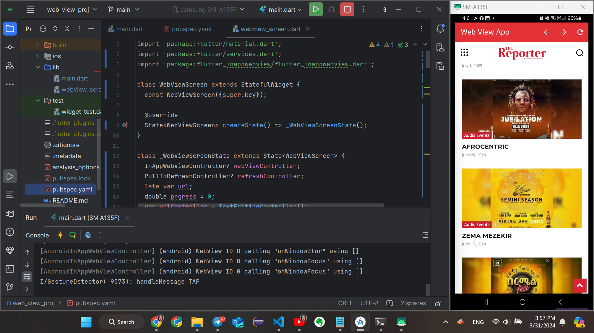

# Web View Project

# The Reporter WebView Application

Welcome to The Reporter WebView Application! This Flutter application provides a simple and clean interface for accessing The Reporter website using a WebView component. It is designed to offer a seamless browsing experience with intuitive controls and proper error handling. Below are some key features and guidelines for using this application effectively.

## Features

1. **Simple Interface**: The application offers a straightforward interface focused on providing easy access to The Reporter website content.

2. **WebView Component**: The core functionality of the application revolves around a WebView component, which displays the content of The Reporter website.

3. **Navigation Controls**: You can navigate through the website using navigation controls that include options for going back, forward, and refreshing the page.

4. **Progress Bar**: The application features a progress bar to indicate the loading progress of the web pages. This provides users with visual feedback while browsing.

5. **Error Handling**: Proper error handling is implemented to deal with scenarios such as no internet connection or page load failures. Users will be informed of any errors encountered during browsing.

6. **Responsiveness**: The application is designed to adjust smoothly to different screen sizes and orientations. Whether you're using a phone or a tablet, the app will adapt to provide an optimal viewing experience.

7. **User Experience**: The focus is on delivering a user-friendly experience with intuitive controls. Users should find it easy to navigate the application and access the desired content from The Reporter website.

## Usage

To use the application, simply install it on your device and launch it. You will be presented with The Reporter website within the WebView component. From there, you can navigate through the website using the provided controls and enjoy a seamless browsing experience.

## Getting Started

To get started with development or to contribute to the project, follow these steps:

1. Clone the repository to your local machine.
2. Ensure you have Flutter installed on your system.
3. Open the project in your preferred IDE or text editor.
4. Make any necessary modifications or improvements.
5. Test your changes thoroughly.
6. Submit a pull request with your changes for review.

## Feedback

Your feedback is valuable in improving the application. If you encounter any issues, have suggestions for new features, or want to report a bug, please don't hesitate to open an issue on GitHub or reach out to the project maintainers.

